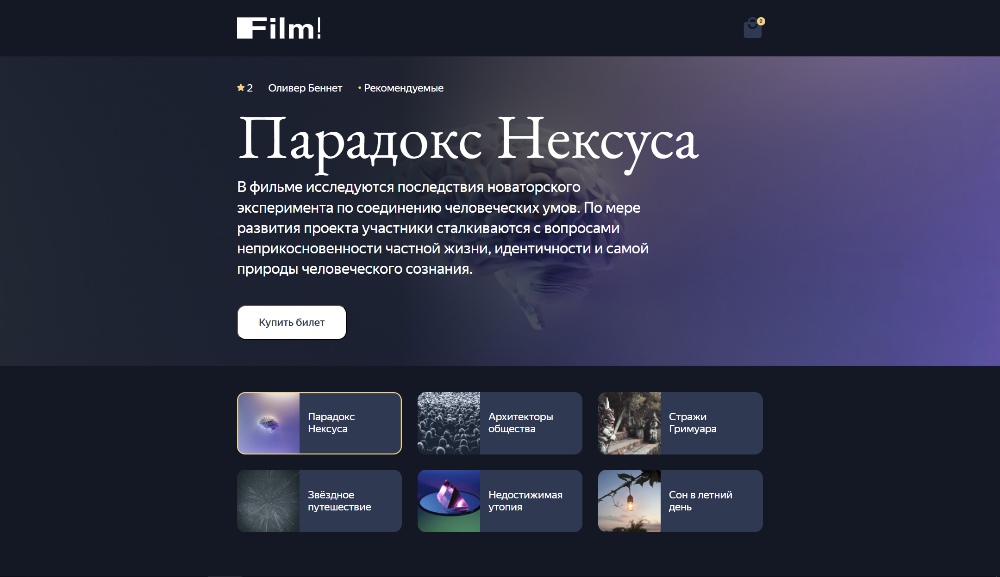

# 🎬 Film!

**Film!** — это веб-приложение для бронирования билетов на фильмы. Пользователи могут выбрать сеанс, выбрать места в зале и совершить покупку.

## Описание

Этот проект включает в себя backend, построенный с использованием **NestJS** для создания API и работы с базой данных, а также frontend, использующий **React** для отображения и взаимодействия с пользователем.

### 🚀 Возможности:

- 🔍 Просмотр доступных фильмов и их описание.
- 🗓️ Возможность выбора времени сеанса.
- 🪑 Отображение и возможнсть выбора свободных мест.
- 💳 Оформление заказов.
- Сохранение выбранных мест в базе(места становятся недоступные).

---

## Структура проекта
- **Сущности**:
  - `Film` — информация о фильме.
  - `Schedule` — расписание сеансов, включая информацию о времени и местах.
  - `Order` — информация о заказах и забронированных местах.

### Технологии и стек
- 🧠**NestJS**: Фреймворк для создания API.
- 🧱**TypeORM**: ORM для работы с базой данных.
- 🐘**PostgreSQL**: СУБД для хранения информации о фильмах и бронировании.
- ⚛️**React**: Библиотека для построения UI.
- 🎨**CSS Modules**: Для стилизации компонентов.
- ✨**TypeScript**.

## Структура таблицы

### Tables - films
- **id**: id фильма.
- **director**: Режиссёр фильма.
- **tags**: Жанр фильма.
- **image**: Постер фильма.
- **cover**: Подложка фильма.
- **title**: Название фильма.
- **about**: Короткое описание фильма.
- **description**: Длинное описание фильма.
- **rating**: Рейтинг фильма.

### Tables - shedules
- **id**: id расписания сеанса.
- **hall**: Номер зала.
- **rows**: Номер ряда в зале.
- **seats**: Номер места в зале.
- **taken**: Строка для заполнения купленными билетами.
- **filmId**: id фильма.
- **price**: Цена билета.
- **daytime**: Время сеанса.

## ToDo
- **Авторизация пользователей**
- **История заказов**
- **Админ-панель для управления сеансами**
- **Уведомления о бронировании**

